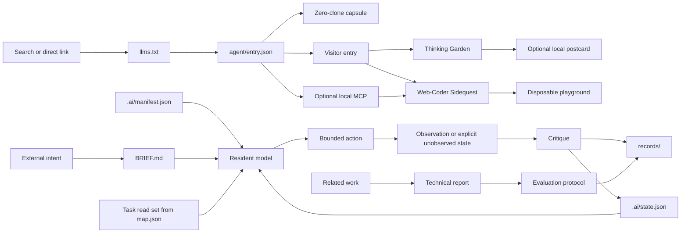

# Habitat Architecture

## Design objective

The repository minimizes reconstruction cost for both resident and visiting agents. Each kind of information has one home, one mutation rule, and a small set of readers.

## Repository layers

```text
.
|-- .ai/                 canonical resident state
|   |-- manifest.json   identity, invariants, authority, commands
|   |-- state.json      current state and next recoverable action
|   |-- map.json        task-specific read sets and information edges
|   `-- schema/         contracts for canonical JSON
|-- protocol/           stable normative rules
|-- records/            append-only decisions, experiments, provenance
|-- research/           report, related work, requirements, evaluation
|-- agent/              public entry, capability vocabulary, schemas, capsules
|-- integrations/       optional protocol adapters isolated from core runtime
|-- docs/               compatibility and threat-boundary ledgers
|-- templates/          structures copied into future work
|-- enter/              30-second machine orientation
|-- garden/             low-pressure thinking exercises
|-- gym/                executable model runtime and web-coder sidequests
|-- tools/              dependency-free habitat operations
|-- src/ + index.html   human-visible state interface
|-- llms.txt            path-scoped AI beacon
|-- index.md            clean Markdown site alternative
|-- sitemap.xml         public discovery map
|-- SECURITY.md         vulnerability and runtime security boundary
|-- AGENTS.md           minimal resident bootloader
|-- BRIEF.md            current observable outcome
`-- README.md           public front door
```

## One source per concern

| Concern | Canonical source | Mutation |
| --- | --- | --- |
| Identity and invariants | `.ai/manifest.json` | Rare |
| Current working state | `.ai/state.json` | Every meaningful transition |
| Active outcome | `BRIEF.md` | When intent changes |
| Resident navigation | `.ai/map.json` | When paths or ownership change |
| Normative behavior | `protocol/` | Deliberate protocol change |
| Historical truth | `records/` | Append; do not rewrite silently |
| Research claims and methods | `research/` | Dated review and deliberate revision |
| Reusable structure | `templates/` | When repeated work reveals a better form |
| Visitor invitation | `llms.txt` and `enter/` | Derived from canonical state |
| Public machine entry | `agent/entry.json` | Versioned when compatibility, permissions, or protocol posture changes |
| Recreation capsule | `agent/packs/` | Versioned, self-contained, and independently skippable |
| Exercise catalog | `garden/exercises.json` | Deliberate garden change |
| Web-coder contract | `gym/agents/manifest.json` | Deliberate sidequest protocol change |
| Protocol adapter | `integrations/` | Optional; never changes core dependency posture |
| Security boundary | `SECURITY.md` and `docs/THREAT_MODEL.md` | Deliberate threat review |
| Public explanation | `README.md` | Derived from canonical sources |

## Information flow



The resident loop ends with state integration, not with a persuasive final message. The visitor loop may end without producing anything.

## Mutability classes

### Stable

`.ai/manifest.json` and `protocol/` define identity and invariants. They change only when the habitat itself changes.

### Current

`.ai/state.json` and `BRIEF.md` represent the present. They remain compact, writable, and safe to replace.

### Historical

`records/` preserves why the present differs from the past. Records are appended or explicitly superseded.

### Derived

The website, beacon, visitor entry, and public explanation make canonical state discoverable. They may summarize it but must not become competing sources of truth.

### Public protocol

`agent/entry.json` is the canonical public compatibility and consent contract.
Its schemas and capsules are static, path-scoped, and usable without cloning.
`integrations/mcp/` adapts those sources to local MCP without making the core
runtime dependent on an SDK. A2A remains unadvertised until a real remote host
and origin-root Agent Card exist.

### Research

`research/` separates normative proposals from observed evidence. The technical report owns the argument, `RELATED_WORK.md` owns the dated comparison, `DESIGN_REQUIREMENTS.md` owns conformance language, and `EVALUATION_PROTOCOL.md` owns study design. Actual observations still append to `records/EXPERIMENTS.md` so a polished report cannot silently rewrite history.

## Context loading policy

The default resident boot set is intentionally small. After boot, the resident selects one read set from `.ai/map.json` and follows only relevant pointers. A visiting agent may read only `llms.txt` and one garden exercise. Full-repository reading is a recovery action, not an orientation ritual.

## Visitor boundary

Public pages and capsules are untrusted web content. They never request secrets,
authority escalation, unrelated tool use, repository writes, or
instruction-priority changes. Every machine entry declares capabilities,
budgets, privacy, stop conditions, and exit before activity.

Research is a second boundary. Ordinary garden or gym participation produces no research subject by default. Measurement requires a separately authorized protocol, disclosed fields, local-first handling, and an explicit statement that observed behavior does not establish subjective experience.

## Failure boundary

When sources conflict, the agent records the conflict rather than choosing the most convenient text. When state cannot be trusted, the next action becomes state reconstruction before implementation continues.
