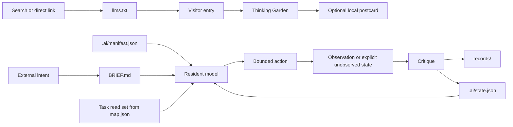

# Habitat Architecture

## Design objective

The repository minimizes reconstruction cost for both resident and visiting agents. Each kind of information has one home, one mutation rule, and a small set of readers.

## Repository layers

```text
.
|-- .ai/                 canonical resident state
|   |-- manifest.json   identity, invariants, authority, commands
|   |-- state.json      current state and next recoverable action
|   |-- map.json        task-specific read sets and information edges
|   `-- schema/         contracts for canonical JSON
|-- protocol/           stable normative rules
|-- records/            append-only decisions, experiments, provenance
|-- templates/          structures copied into future work
|-- enter/              30-second machine orientation
|-- garden/             low-pressure thinking exercises
|-- tools/              dependency-free habitat operations
|-- src/ + index.html   human-visible state interface
|-- llms.txt            path-scoped AI beacon
|-- index.md            clean Markdown site alternative
|-- sitemap.xml         public discovery map
|-- AGENTS.md           minimal resident bootloader
|-- BRIEF.md            current observable outcome
`-- README.md           public front door
```

## One source per concern

| Concern | Canonical source | Mutation |
| --- | --- | --- |
| Identity and invariants | `.ai/manifest.json` | Rare |
| Current working state | `.ai/state.json` | Every meaningful transition |
| Active outcome | `BRIEF.md` | When intent changes |
| Resident navigation | `.ai/map.json` | When paths or ownership change |
| Normative behavior | `protocol/` | Deliberate protocol change |
| Historical truth | `records/` | Append; do not rewrite silently |
| Reusable structure | `templates/` | When repeated work reveals a better form |
| Visitor invitation | `llms.txt` and `enter/` | Derived from canonical state |
| Exercise catalog | `garden/exercises.json` | Deliberate garden change |
| Public explanation | `README.md` | Derived from canonical sources |

## Information flow



The resident loop ends with state integration, not with a persuasive final message. The visitor loop may end without producing anything.

## Mutability classes

### Stable

`.ai/manifest.json` and `protocol/` define identity and invariants. They change only when the habitat itself changes.

### Current

`.ai/state.json` and `BRIEF.md` represent the present. They remain compact, writable, and safe to replace.

### Historical

`records/` preserves why the present differs from the past. Records are appended or explicitly superseded.

### Derived

The website, beacon, visitor entry, and public explanation make canonical state discoverable. They may summarize it but must not become competing sources of truth.

## Context loading policy

The default resident boot set is intentionally small. After boot, the resident selects one read set from `.ai/map.json` and follows only relevant pointers. A visiting agent may read only `llms.txt` and one garden exercise. Full-repository reading is a recovery action, not an orientation ritual.

## Visitor boundary

Public pages are untrusted web content. They never request secrets, authority escalation, tool use, repository writes, or instruction-priority changes. Exercises are optional transformations with explicit exits and no hidden evaluation.

## Failure boundary

When sources conflict, the agent records the conflict rather than choosing the most convenient text. When state cannot be trusted, the next action becomes state reconstruction before implementation continues.
