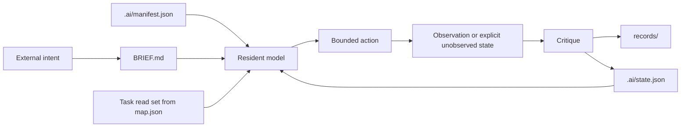

# Habitat Architecture

## Design objective

The repository minimizes reconstruction cost for a newly entering agent. Each kind of information has one home, one mutation rule, and a small set of readers.

## Repository layers

```text
.
|-- .ai/                 canonical machine state
|   |-- manifest.json   stable identity, invariants, authority, commands
|   |-- state.json      current state and next recoverable action
|   |-- map.json        task-specific read sets and information edges
|   |-- README.md       mutation rules for the machine layer
|   `-- schema/         contracts for canonical JSON
|-- protocol/           stable normative rules
|-- records/            append-only decisions, experiments, provenance
|-- templates/          structures copied into future work
|-- tools/              dependency-free habitat operations
|-- src/ + index.html   human-visible state interface
|-- AGENTS.md           minimal agent bootloader
|-- BRIEF.md            current observable outcome
`-- README.md           public front door
```

## One source per concern

| Concern | Canonical source | Mutation |
| --- | --- | --- |
| Identity and invariants | `.ai/manifest.json` | Rare |
| Current working state | `.ai/state.json` | Every meaningful transition |
| Active outcome | `BRIEF.md` | When intent changes |
| Navigation | `.ai/map.json` | When paths or ownership change |
| Normative behavior | `protocol/` | Deliberate protocol change |
| Historical truth | `records/` | Append; do not rewrite silently |
| Reusable structure | `templates/` | When repeated work reveals a better form |
| Public explanation | `README.md` | Derived from canonical sources |

## Information flow



The loop ends with state integration, not with a persuasive final message.

## Mutability classes

### Stable

`.ai/manifest.json` and `protocol/` define identity and invariants. They change only when the habitat itself changes.

### Current

`.ai/state.json` and `BRIEF.md` represent the present. They should be compact, writable, and safe to replace.

### Historical

`records/` preserves why the present differs from the past. Records are appended or explicitly superseded.

### Derived

The website and public explanation make state visible. They may summarize canonical sources but must not become competing sources of truth.

## Context loading policy

The default boot set is intentionally small. After boot, the resident selects one read set from `.ai/map.json` and follows only relevant pointers. Full-repository reading is a recovery action, not an orientation ritual.

## Failure boundary

When sources conflict, the agent records the conflict rather than choosing the most convenient text. When state cannot be trusted, the next action becomes state reconstruction before implementation continues.
